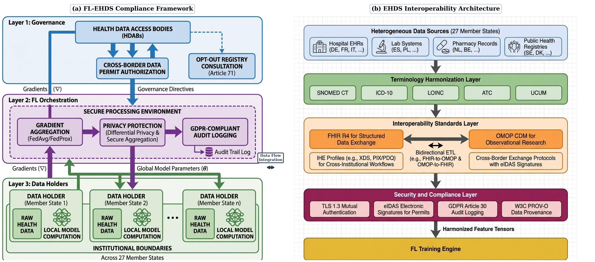

# FL-EHDS: A Privacy-Preserving Federated Learning Framework for the European Health Data Space

[](LICENSE)
[](https://www.python.org/)
[](https://pytorch.org/)
[]()
[]()
[]()

> **Accompanying paper**: *FL-EHDS: A Privacy-Preserving Federated Learning Framework for the European Health Data Space*
> Submitted to [FLICS 2026](https://www.flics-conference.org/) -- 2nd International Conference on Federated Learning and Intelligent Computing Systems, Valencia, Spain, June 9--12, 2026.

---

## Abstract 

**FL-EHDS** is a three-layer compliance framework that bridges the technology–governance divide for cross-border health analytics under the [European Health Data Space (EHDS)](https://health.ec.europa.eu/ehealth-digital-health-and-care/european-health-data-space_en), Regulation (EU) 2025/327. It integrates 17 federated learning algorithms (2017–2025) with EHDS governance mechanisms—Health Data Access Bodies (HDABs), data permits, citizen opt-out registries—and data holder components for adaptive training with FHIR R4 preprocessing.

---
<p align="center">
  
</p>

<p align="center"><em>
<strong>Figure 1.</strong> FL-EHDS composite architecture. (a) Three-layer compliance framework: Layer 1 (Governance) manages HDAB integration, data permit authorisation, and Article 71 opt-out registries; Layer 2 (FL Orchestration) operates within the Secure Processing Environment with gradient aggregation, differential privacy, and GDPR-compliant audit logging; Layer 3 (Data Holders) implements local model computation with raw health data never leaving institutional boundaries. (b) EHDS interoperability pipeline: heterogeneous sources across 27 Member States flow through terminology harmonisation, interoperability standards (FHIR R4, OMOP CDM, IHE profiles), and security/compliance layers before reaching the FL training engine.
</em></p>

---
## Table of Contents

- [FL-EHDS: A Privacy-Preserving Federated Learning Framework for the European Health Data Space](#fl-ehds-a-privacy-preserving-federated-learning-framework-for-the-european-health-data-space)
  - [Abstract](#abstract)
  - [Table of Contents](#table-of-contents)
  - [Motivation](#motivation)
  - [Architecture](#architecture)
  - [Key Contributions](#key-contributions)
  - [Experimental Highlights](#experimental-highlights)
  - [Dataset Coverage](#dataset-coverage)
  - [Algorithm Catalogue](#algorithm-catalogue)
  - [Installation](#installation)
    - [Prerequisites](#prerequisites)
    - [Setup](#setup)
  - [Reproducing Experiments](#reproducing-experiments)
    - [Tabular Experiments](#tabular-experiments)
    - [Imaging Experiments](#imaging-experiments)
    - [Per-Dataset Configuration](#per-dataset-configuration)
  - [Repository Structure](#repository-structure)
  - [Citation](#citation)
  - [License](#license)
  - [Acknowledgements](#acknowledgements)

---

## Motivation

The EHDS mandates cross-border secondary use of health data across 27 EU Member States by 2029, yet fewer than one in four FL implementations achieve sustained production deployment in healthcare (Fröhlich et al., JMIR 2025). The dominant barriers are not purely technical: unresolved legal questions—gradient data classification under GDPR, cross-border privacy budget harmonization, controller/processor allocation—create compliance uncertainties that no engineering solution alone can resolve. FL-EHDS addresses this gap by providing an integrated framework that operationalises EHDS governance requirements alongside state-of-the-art FL algorithms.

---

## Architecture

FL-EHDS is organised into three layers following the EHDS data flow:

| Layer | Scope | Key Components |
|-------|-------|----------------|
| **L1 — Governance** | HDAB integration, regulatory compliance | Data Permit Manager (Art. 53), Opt-Out Registry (Art. 71), Cross-Border Coordinator (Arts. 46, 50), GDPR Art. 30 audit trail |
| **L2 — FL Orchestration** | Secure Processing Environment (SPE) | 17 aggregation algorithms, DP-SGD with RDP accounting, secure aggregation (pairwise masking, ECDH), 6 Byzantine resilience methods, compliance module |
| **L3 — Data Holders** | Institutional computation | Adaptive local training engine, FHIR R4 preprocessing, OMOP-CDM harmonization, secure gradient communication (AES-256-GCM, mTLS) |

**Architectural invariant:** raw health data never leaves institutional boundaries—only encrypted model gradients are exchanged within the SPE.

The governance layer includes a fully functional simulation backend (OAuth2/mTLS authentication, permit CRUD, LRU-cached registry lookups) that requires only endpoint configuration—not architectural changes—for production binding to HDAB services (expected 2027–2029).

---

## Key Contributions

1. **Barrier Taxonomy.** Systematic evidence synthesis of 47 documents (PRISMA methodology, GRADE-CERQual confidence assessment) identifying legal uncertainties as the critical adoption blocker.

2. **FL-EHDS Framework.** Three-layer reference architecture mapping identified barriers to governance-aware mitigation strategies, designed for incremental deployment during the 2025–2031 EHDS transition.

3. **Reference Implementation.** Open-source Python codebase (~40K lines, 159 modules) with 17 FL algorithms, EHDS governance modules, and an interactive deployment dashboard.

4. **Experimental Validation.** 1,740+ experiments across tabular clinical and medical imaging datasets with differential privacy ablation (ε ∈ {1, 5, 10, 50}), Article 71 opt-out simulation, and 10-seed statistical validation.

---

## Experimental Highlights

Results from the primary evaluation (7 algorithms × 3 datasets × 5 seeds, plus sweep phases, DP ablation, opt-out simulation, and extended 10-seed validation):

| Finding | Evidence |
|---------|----------|
| Personalized FL narrows the centralized–federated gap to **6.6 pp** | Ditto 75.1% vs. centralized 81.7% on Heart Disease UCI |
| Algorithm selection yields up to **12.6 pp** accuracy differences | Ditto 75.1% vs. FedAvg 62.5% (Heart Disease); 11.4 pp on Cardiovascular |
| **HPFL** (ICLR 2025) outperforms FedAvg on all datasets | p = 0.004, 0.002, 0.031 (Wilcoxon, 10-seed); pooled p < 0.001 |
| Privacy at ε = 10 is essentially free | < 2 pp accuracy cost across PTB-XL and Cardiovascular |
| DP noise as regularisation on small cohorts | FedAvg with ε = 5 reaches 78.7% vs. 52.3% without DP on Breast Cancer (+26.4 pp) |
| Article 71 opt-out at 30% has negligible impact | < 1 pp drop on adequately sized datasets (PTB-XL, Cardiovascular) |
| Personalization scales with federation size | Ditto degrades by only −0.8 pp from K = 5 to K = 100 (vs. −4.7 pp for FedAvg) |
| PTB-XL validates European FL | 92.5% accuracy (HPFL) on 5-class ECG diagnosis with Jain fairness 0.999 |

---

## Dataset Coverage

The framework supports 19 healthcare datasets across four modalities. Eight are experimentally evaluated:

| Dataset | Samples | Type | Classes | FL Partition | EHDS Category |
|---------|---------|------|---------|--------------|---------------|
| PTB-XL ECG | 21,799 | Tabular | 5 | Natural (52 EU sites) | SCP-ECG diagnostics |
| Cardiovascular Disease | 70,000 | Tabular | 2 | Dirichlet (α = 0.5) | Vitals, lab, risk factors |
| Diabetes 130-US | 101,766 | Tabular | 2 | Dirichlet (α = 0.5) | EHR, ICD-9, medications |
| Heart Disease UCI | 920 | Tabular | 2 | Natural (4 hospitals) | Vitals, ECG, lab results |
| Breast Cancer Wisconsin | 569 | Tabular | 2 | Dirichlet (α = 0.5) | Pathology (FNA cytology) |
| Chest X-ray | 5,856 | Imaging | 2 | Dirichlet (α = 0.5) | Radiology (DICOM) |
| Brain Tumor MRI | 3,064 | Imaging | 4 | Dirichlet (α = 0.5) | Neuro-imaging (DICOM) |
| Skin Cancer | 3,297 | Imaging | 2 | Dirichlet (α = 0.5) | Dermatology (DICOM) |

Additional supported datasets include Stroke Prediction, CDC Diabetes BRFSS, CKD UCI, Cirrhosis Mayo, Synthea FHIR R4, SMART Bulk FHIR, Diabetic Retinopathy, and ISIC Skin Lesions. Full details in Supplementary Material, Table S1.

---

## Algorithm Catalogue

17 FL algorithms spanning six categories:

| Category | Algorithms | Venues |
|----------|-----------|--------|
| Baseline | FedAvg, FedProx, FedNova, FedDyn | AISTATS'17, MLSys'20, NeurIPS'20, ICLR'21 |
| Non-IID robustness | SCAFFOLD | ICML'20 |
| Adaptive optimisation | FedAdam, FedYogi, FedAdagrad | ICLR'21 |
| Personalisation | Ditto, Per-FedAvg | ICML'21, NeurIPS'20 |
| Label skew / Representation | FedLC, FedDecorr, FedSAM | ICML'22, ICLR'23, ICML'22 |
| Recent advances (2023–2025) | FedSpeed, FedExP, **FedLESAM**, **HPFL** | ICLR'23, ICLR'23, **ICML'24 Spotlight**, **ICLR'25** |

Six Byzantine resilience methods: Krum, Multi-Krum, Trimmed Mean, Coordinate-wise Median, Bulyan, FLTrust.

---

## Installation

### Prerequisites

- Python ≥ 3.10
- PyTorch ≥ 2.0
- CUDA-capable GPU (optional; CPU and Apple Silicon MPS supported)

### Setup

```bash
git clone https://github.com/FabioLiberti/FL-EHDS-FLICS2026.git
cd FL-EHDS-FLICS2026
pip install -r requirements.txt
```

---

## Reproducing Experiments

All experiments reported in the paper can be reproduced via the benchmark suite. Results, checkpoints, and analysis outputs are auto-saved to `benchmarks/paper_results/` and `benchmarks/paper_results_tabular/`.

### Tabular Experiments

```bash
# Baseline comparison (105 experiments, ~45 min)
python -m benchmarks.run_tabular_optimized

# Multi-phase sweep: heterogeneity, client scaling, learning rate (1,125 experiments, ~4.5h)
python -m benchmarks.run_tabular_sweep --phase all

# Differential privacy ablation (180 experiments, ~1.5h)
python -m benchmarks.run_tabular_dp

# 10-seed statistical validation (105 experiments, ~40 min)
python -m benchmarks.run_tabular_seeds10

# Article 71 opt-out impact (225 experiments, ~1.5h)
python -m benchmarks.run_tabular_optout

# Deep MLP differentiation (70 experiments, ~1.5h)
python -m benchmarks.run_tabular_deep_mlp

# Extended analysis: generates all tables and figures
python -m benchmarks.analyze_tabular_extended
```

### Imaging Experiments

```bash
# Full imaging experiments (7 algorithms × 5 datasets × 3 seeds)
python -m benchmarks.run_full_experiments

# Quick validation (~1–2h)
python -m benchmarks.run_full_experiments --quick

# Resume after interruption
python -m benchmarks.run_full_experiments --resume
```

### Per-Dataset Configuration

| Dataset | lr | Batch size | Rounds | K | Partition |
|---------|-----|-----------|--------|---|-----------|
| PTB-XL | 0.005 | 64 | 30 | 5 | Site-based |
| Cardiovascular | 0.01 | 64 | 25 | 5 | Dirichlet α = 0.5 |
| Breast Cancer | 0.001 | 16 | 40 | 3 | Dirichlet α = 0.5 |

All tabular experiments use HealthcareMLP (~10K parameters, 2 hidden layers [64, 32], ReLU, dropout 0.3) with Adam optimiser and early stopping (patience = 6). Imaging experiments use ResNet-18 (~11.2M parameters) with GroupNorm and FedBN.

---

## Repository Structure

```
FL-EHDS-FLICS2026/
├── fl_ehds/                    # Core framework (~40K lines, 159 modules)
│   ├── governance/             # Layer 1: HDAB integration, permits, opt-out
│   │   ├── hdab_integration/   #   OAuth2/mTLS, permit store, strictness levels
│   │   ├── permit_manager/     #   Article 53 lifecycle (PENDING→ACTIVE→EXPIRED)
│   │   ├── optout_registry/    #   Article 71 filtering (record/patient/dataset)
│   │   └── cross_border/       #   Multi-HDAB coordination, 10 EU country profiles
│   ├── orchestration/          # Layer 2: FL within SPE
│   │   ├── algorithms/         #   17 FL algorithms
│   │   ├── privacy/            #   DP-SGD, RDP accounting, secure aggregation
│   │   ├── byzantine/          #   6 resilience methods + attack simulation
│   │   ├── compliance/         #   GDPR Art. 30 audit, purpose limitation
│   │   └── communication/      #   gRPC/WebSocket, compression, serialisation
│   ├── data_holders/           # Layer 3: institutional components
│   │   ├── training/           #   Adaptive local training engine
│   │   ├── preprocessing/      #   FHIR R4 pipeline, OMOP-CDM harmonisation
│   │   └── security/           #   AES-256-GCM, ECDHE, mTLS
│   └── monitoring/             # Prometheus metrics, Grafana dashboards
├── benchmarks/                 # Reproducible experiment suite
│   ├── run_tabular_optimized.py
│   ├── run_tabular_sweep.py
│   ├── run_tabular_dp.py
│   ├── run_tabular_seeds10.py
│   ├── run_tabular_optout.py
│   ├── run_tabular_deep_mlp.py
│   ├── run_full_experiments.py
│   ├── analyze_tabular_extended.py
│   └── paper_results/          # Auto-generated results and figures
├── dashboard/                  # Streamlit interactive UI
├── datasets/                   # Dataset loaders and preprocessing
├── docs/                       # Extended documentation
├── requirements.txt
└── README.md
```

---

## Citation

If you use FL-EHDS in your research, please cite:

```bibtex
@inproceedings{liberti2026flehds,
  title     = {{FL-EHDS}: A Privacy-Preserving Federated Learning Framework 
               for the {European Health Data Space}},
  author    = {Liberti, Fabio},
  booktitle = {Proceedings of the IEEE International Conference on 
               Federated Learning in Integrated Computing and Services (FLICS)},
  year      = {2026}
}
```

---

## License

This project is released under the [MIT License](LICENSE).

---

## Acknowledgements

The author thanks Prof. Sadi Alawadi for supervision and guidance.

---

**Contact:** Fabio Liberti — [fabio.liberti@studenti.unimercatorum.it](mailto:fabio.liberti@studenti.unimercatorum.it) — ORCID: [0000-0003-3019-5411](https://orcid.org/0000-0003-3019-5411)
